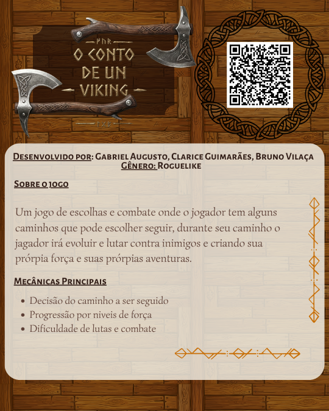
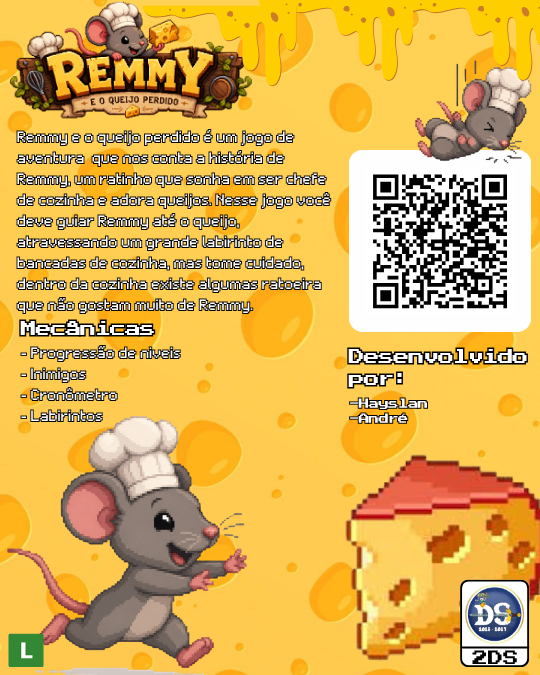
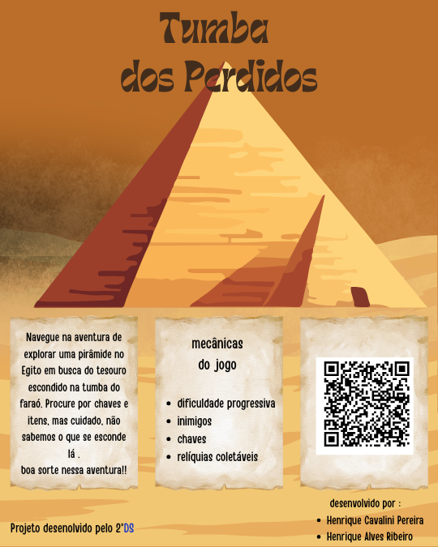
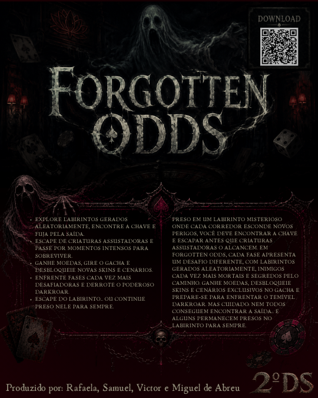
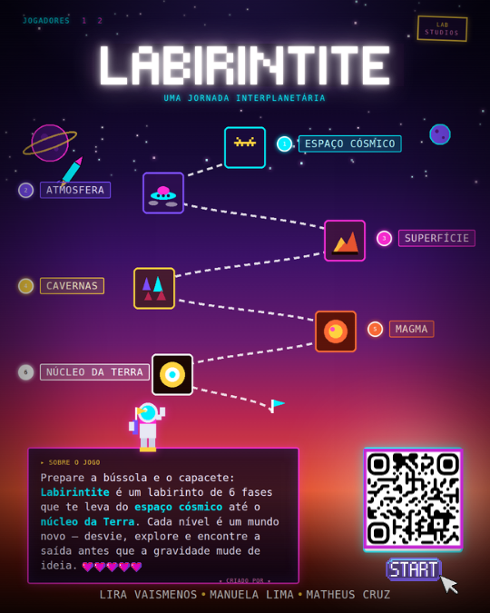
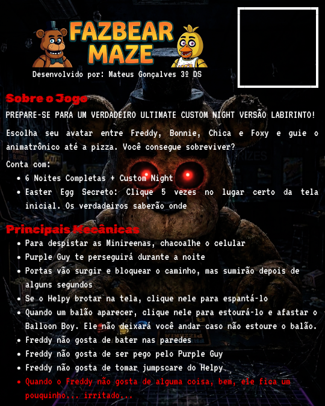

# 🎮 1ª Feira de Games Mobile - ETEC Dr. Júlio Cardoso

Bem-vindos ao repositório oficial da mostra de jogos desenvolvidos em Flutter/Dart pelas turmas de 2º e 3º ano de Desenvolvimento de Sistemas.

> **Data:** 25 de Junho de 2026
> **Aviso de Instalação:** Para jogar, você precisará permitir a instalação de "Fontes Desconhecidas" nas configurações do seu Android.

---

## 🕹️ Catálogo de Jogos

### 1. O Conto de um Viking
**Desenvolvedores:** Gabriel Augusto, Clarice Guimarães, Bruno Vilaça

**Turma:** 2º Ano DS

Um jogo de escolhas e combate onde o jogador tem alguns caminhos que pode escolher seguir, durante seu caminho o jagador irá evoluir e lutar contra inimigos e criando sua prórpia força e suas prórpias aventuras.

- **Gênero:** Roguelike
- **Mecânicas:**
      Decisão do caminho a ser seguido
      Progressão por niveis de força
      Dificuldade de lutas e combate

👉 **[BAIXAR APK DO LABIRINTO](link-direto-da-release-aqui)**

---

### 2. Cult of Leaves
**Desenvolvedores:** Gabriel Augusto, Clarice Guimarães, Bruno Vilaça

**Turma:** 2º Ano DS

Um jogo de suspense e sobrevivência onde o jogador explora um labirinto repleto de mistérios enquanto tenta escapar de um monstro que o persegue. Com diferentes caminhos e desafios, cada decisão pode ser a chave para a sobrevivência ou para um destino sombrio.

- **Gênero:** Quebra-cabeça / Arcade
- **Mecânicas:**
      - Exploração do labirinto
      - Combate com arma
      - Perseguição de monstro
      - Resolução de desafios

👉 **[BAIXAR APK DO LABIRINTO](link-direto-da-release-aqui)**

---

### 3. Labirinto dos Infelizes
**Desenvolvedores:** João Victor Silva Rodrigues e Daniel Barros Cruz

**Turma:** 2º Ano DS

Labirinto dos Infelizes é um jogo de exploração e suspense onde dois amigos entram em um bosque misterioso e acabam se separando. Perdido em um labirinto vivo e amaldiçoado, o player encontra criaturas estranhas que revelam a história de uma entidade que transformou a floresta em uma prisão eterna. Para escapar, ele precisará atravessar labirintos, descobrir segredos e enfrentar a criatura no coração do bosque.

- **Gênero:** Quebra-cabeça / Arcade
- **Mecânicas:**
      Exploração de labirintos procedurais
      Progressão narrativa por fases
      NPCs e diálogos inspirados em Undertale
      Coleta de itens / inventário
      Batalha final com escolhas e mecânicas próprias
      Geração procedural de mapas/labirintos
      Sistema de colisão e movimentação topdown
      Máquina de estados (exploração, diálogo batalha, eventos)

👉 **[BAIXAR APK DO LABIRINTO](link-direto-da-release-aqui)**

---

### 4. Álbum Perdido
**Desenvolvedores:** Arthur Miguel de Souza, Gabriela Faleiros Moreira, Henrique Aguiar Ferreira

**Turma:** 2º Ano DS

Álbum Perdido é um jogo de labirinto inspirado na Copa do Mundo. Os jogadores devem atravessar fases cada vez mais difíceis, coletando moedas e desbloqueando pacotes de figurinhas para completar um álbum de jogadores. Além disso, o jogo conta com um minijogo de adivinhação, onde é preciso identificar atletas por imagens borradas, recebendo mais pontos quanto mais rápido acertar.

- **Gênero:** Quebra-cabeça / Arcade
- **Mecânicas:**
-    Labirintos com dificuldade progressiva por fase
   Cada novo nível apresenta mapas maiores e mais desafiadores, Ganhe recompensas por completar desafios.

Pacotes de Figurinhas
   Ao concluir uma fase, você recebe um pacote de figurinhas. Colecione jogadores e complete o álbum dentro do jogo.

Minijogo "Quem é o Jogador?"
   Identifique jogadores a partir de imagens borradas. Quanto mais cedo acertar, maior será sua pontuação. A imagem revela mais detalhes conforme as tentativas avançam

👉 **[BAIXAR APK DO LABIRINTO](link-direto-da-release-aqui)**

---
### 5. Remmy e o queijo perdido
**Desenvolvedores:** Hayslan e André
**Turma:** 2º Ano DS

Remmy e o queijo perdido é um jogo de aventura  que nos conta a história de Remmy, um ratinho que sonha em ser chefe de cozinha e adora queijos. Nesse jogo você deve guiar Remmy até o queijo, atravessando um grande labirinto de bancadas de cozinha, mas tome cuidado, dentro da cozinha existe alguns cozinheiros que não gostam muito de Remmy.

- **Gênero:** Quebra-cabeça / Arcade
- **Mecânicas:**
-     Exploração de labirintos procedurais
      Progressão narrativa por fases
      NPCs e diálogos inspirados em Undertale
      Coleta de itens / inventário
      Batalha final com escolhas e mecânicas próprias
      Geração procedural de mapas/labirintos
      Sistema de colisão e movimentação topdown
      Máquina de estados (exploração, diálogo, batalha, eventos)

👉 **[BAIXAR APK DO LABIRINTO](https://github.com/RauniCosta/feiragames/releases/download/Remmy/remmy.apk)**

---

### 6. Tumba dos Perdidos
**Desenvolvedores:** Henrique Cavaline Pereira, Henrique Alves Ribeiro

**Turma:** 2º Ano DS

Navegue na aventura de explorar uma pirâmide no Egito em busca do tesouro escondido na tumba do faraó. Procure por chaves e itens, mas cuidado, não sabemos o que se esconde lá .
boa sorte nessa aventura!!

- **Gênero:** Quebra-cabeça / Arcade
- **Mecânicas:**
      Dificuldade progressiva  
      Inimigos  
      Chaves  
      Relíquias coletáveis

👉 **[BAIXAR APK DO LABIRINTO](link-direto-da-release-aqui)**

---

### 7. Forgotten ODDS
**Desenvolvedores:** Rafaela, Samuel, Victor, Miguel Abreu

**Turma:** 2º Ano DS

      PRESO EM UM LABIRINTO MISTERIOSO ONDE CADA CORREDOR ESCONDE NOVOS PERIGOS, VOCÊ DEVE ENCONTRAR A CHAVE E ESCAPAR ANTES QUE CRIATURAS ASSUSTADORAS O ALCANCEM.
      EM FORGOTTEN ODDS, CADA FASE APRESENTA UM DESAFIO DIFERENTE, COM LABIRINTOS GERADOS ALEATORIAMENTE, INIMIGOS CADA VEZ MAIS MORTAIS E SEGREDOS PELO CAMINHO.
      GANHE MOEDAS, DESBLOQUEIE SKINS E CENÁRIOS EXCLUSIVOS NO GACHA E PREPARE-SE PARA ENFRENTAR O TEMÍVEL DARKROAR. MAS CUIDADO:
      
      NEM TODOS CONSEGUEM ENCONTRAR A SAÍDA... E ALGUNS PERMANECEM PRESOS NO LABIRINTO PARA SEMPRE.

- **Gênero:** Quebra-cabeça / Arcade
- **Mecânicas:**
      EXPLORE LABIRINTOS GERADOS ALEATORIAMENTE, ENCONTRE A CHAVE E FUJA PELA SAÍDA.
      ESCAPE DE CRIATURAS ASSUSTADORAS E PASSE POR MOMENTOS INTENSOS PARA SOBREVIVER.
      GANHE MOEDAS, GIRE O GACHA E DESBLOQUEIE NOVAS SKINS E CENÁRIOS.
      ENFRENTE FASES CADA VEZ MAIS DESAFIADORAS E DERROTE O PODEROSO DARKROAR.
      ESCAPE DO LABIRINTO... OU CONTINUE PRESO NELE PARA SEMPRE.

👉 **[BAIXAR APK DO LABIRINTO](https://github.com/RauniCosta/feiragames/releases/download/2ds/app-release.apk)**

---

### 8. Labirintite
**Desenvolvedores:** Lira Vaismenos, Manuela Lima, Matheus Cruz

**Turma:** 2º Ano DS

      Prepare a bússola e o capacete:
      Labirintite é um labirinto de 6 fases que te leva do espaço cósmico até o núcleo da Terra.
      Cada nível é um mundo novo - desvie, explore e encontre a saída antes que a gravidade mude de ideia.

- **Gênero:** Quebra-cabeça / Arcade
- **Mecânicas:**
      Dificuldade progressiva  
      Inimigos

👉 **[BAIXAR APK DO LABIRINTO](https://github.com/RauniCosta/feiragames/releases/download/Labirintite/labirintite.apk)**

---

### 9. Fazbear Maze
**Desenvolvedores: Mateus Gonçalves | **Turma:** 3º Ano DS

PREPARE-SE PARA UM VERDADEIRO ULTIMATE CUSTOM NIGHT VERSÃO LABIRINTO!
Escolha seu avatar entre Freddy, Bonnie, Chica e Foxy e guie o animatrônico até a pizza. Você consegue sobreviver?
Conta com:
      6 Noites Completas + Custom Night Easter Egg Secreto: Clique 5 vezes no lugar certo da tela inicial. Os verdadeiros saberão onde
Principais Mecânicas
      Para despistar as Minireenas, chacoalhe o celular
      Purple Guy te perseguirá durante a noite
      Portas vão surgir e bloquear o caminho, mas sumirão depois de alguns segundos
      Se o Helpy brotar na tela, clique nele para espantá-lo
      Quando um balão aparecer, clique nele para estourá-lo e afastar o Balloon Boy. Ele não deixará você andar caso não estoure o balão.
      Freddy não gosta de bater nas paredes
      Freddy não gosta de ser pego pelo Purple Guy
      Freddy não gosta de tomar jumpscare do Helpy
      Quando o Freddy não gosta de alguma coisa, bem, ele fica um pouquinho... irritado...

- **Gênero:** Labirinto, Terror
- **Destaque Técnico:** Linguagem Flutter

👉 **[BAIXAR APK](https://github.com/RauniCosta/feiragames/releases/download/Fazbeartmaze/fazbear-maze.apk)**

---
